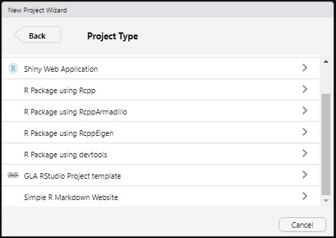
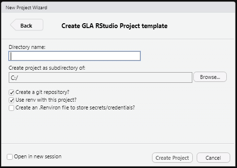

# glarproj

The package provides an RStudio Project template for data projects at
the GLA.

Rstudio projects are a great way to organise your work in R, there’s
more detail on why and how to use them in the [R for Data Science
book](https://r4ds.had.co.nz/workflow-projects.html).

## Installation

To install `glarproj` from github use the
[`devtools`](https://devtools.r-lib.org/) function `install_github`.

``` r
devtools::install_github("Greater-London-Authority/glarproj")
```

## Usage

Once installed the template will appear as an option in the “New
Project” wizard in RStudio.



The template is set up to create the bare bones of an R package, but it
also works for a stand alone project that isn’t going to become a full
package.

## Project layout

This is the basic project layout the template will generate:

    {{ project_name }}               <- parent directory
    ├───data                         <- Data lives here (all included in .gitignore expect README.Rmd)
    │   ├───processed                <- The final dataset(s)
    │   ├───intermediate             <- Intermediate data that has been transformed
    │   ├───raw                      <- The original, immutable data.
    │   └───README.Rmd               <- A README for the data
    ├───man                          <- Documentation lives here
    ├───outputs                      <- Outputs live here (added to .gitignore)
    ├───R                            <- R scripts live here
    ├───.gitignore                   <- Tells git what files to exclude from version control (e.g. data, credentials etc)
    ├───{{ project-name }}.Rproj     <- Rstudio project file
    ├───README.Rmd                   <- A summary of the project
    ├───DESCRIPTION                  <- Project/package meta data. Necessary for making a package, and useful for any project
    └───NAMESPACE                    <- Defines package imports and exports - only needed if your project is a package

## Additional options

When creating the project there are a few extra options to decide



### Create a git repository?

Whether to use git for version control for this project. More
information on using git with R can be found
[here](https://happygitwithr.com/).

If this option is selected a git repository will be created.

### Use `renv` with this project?

Whether to use the
[`renv`](https://rstudio.github.io/renv/articles/renv.html) package to
manage dependencies for this project.

If this option is selected `renv::init()` is used to initialise a new
project-local environment with a private R library.

### Create an `.Renviron` file to store secrets/credentials?

Whether to use a project specific `.Renviron` file to store sensitive
information (e.g. API keys, Database credentials) that shouldn’t be
hard-coded in scripts. If you reuse the same credentials across a lot of
projects it might be more efficient to create a user-level `.Renviron`
file instead. Information on how to use an `.Renviron` file can be found
[here](https://support.rstudio.com/hc/en-us/articles/360047157094-Managing-R-with-Rprofile-Renviron-Rprofile-site-Renviron-site-rsession-conf-and-repos-conf).

If this option is selected an empty `.Renviron` file will be created.

This template was developed using the [RStudio extensions guide to
RStudio project
templates](https://rstudio.github.io/rstudio-extensions/rstudio_project_templates.html)
